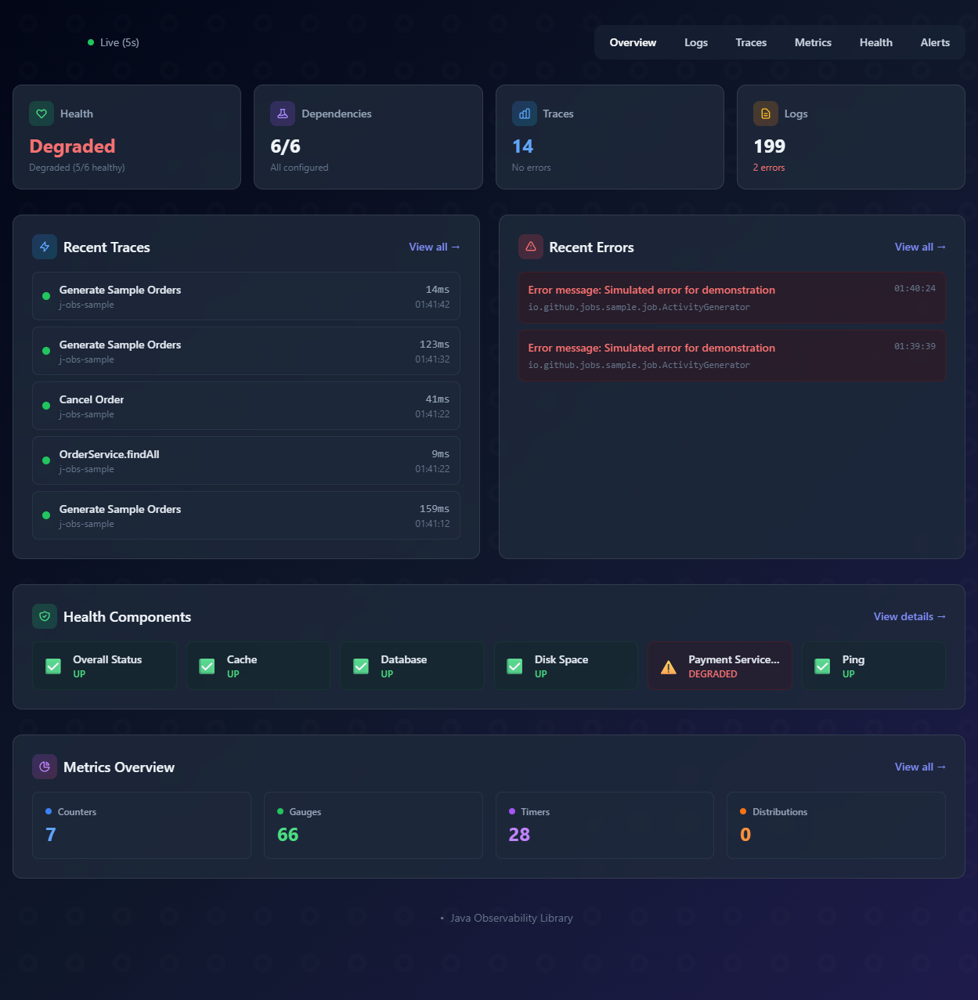

# J-Obs

<div align="center">


**Java Observability Library for Spring Boot**

*Complete out-of-the-box observability with a single dependency*

[Installation](#installation) •
[Features](#features) •
[Screenshots](#screenshots) •
[Configuration](#configuration) •
[Documentation](#documentation)

</div>

---

## Overview

J-Obs adds complete observability to your Spring Boot application with a single dependency. Access the dashboard at `/j-obs` after adding the library.

**What you get:**
- **Traces** - Distributed tracing with OpenTelemetry
- **Logs** - Real-time streaming via WebSocket
- **Metrics** - Micrometer/Prometheus integration
- **Health** - Component health monitoring
- **Alerts** - Notifications via Telegram, Slack, Teams, Email
- **Profiling** - CPU, Memory, Thread analysis
- **And more** - SLO tracking, SQL analysis, anomaly detection

---

## Installation

### Requirements

| Requirement | Version |
|-------------|---------|
| Java | 17+ |
| Spring Boot | 3.2+ |
| Maven/Gradle | 3.6+ / 7.5+ |

### Maven

```xml
<dependency>
    <groupId>io.github.johnpitter</groupId>
    <artifactId>j-obs-spring-boot-starter</artifactId>
    <version>1.0.9</version>
</dependency>
```

### Required Dependencies

```xml
<!-- These are required for J-Obs to work -->
<dependency>
    <groupId>org.springframework.boot</groupId>
    <artifactId>spring-boot-starter-actuator</artifactId>
</dependency>
<dependency>
    <groupId>io.micrometer</groupId>
    <artifactId>micrometer-registry-prometheus</artifactId>
</dependency>

<!-- Optional: Real-time log streaming -->
<dependency>
    <groupId>org.springframework.boot</groupId>
    <artifactId>spring-boot-starter-websocket</artifactId>
</dependency>
```

### Minimal Configuration

```yaml
spring:
  application:
    name: my-app

management:
  endpoints:
    web:
      exposure:
        include: health,info,prometheus,metrics
  endpoint:
    health:
      show-details: always

j-obs:
  enabled: true
```

**That's it!** Start your application and access `http://localhost:8080/j-obs`

---

## Features

| Feature | Description |
|---------|-------------|
| **Distributed Tracing** | Request journey with waterfall visualization |
| **Real-Time Logs** | WebSocket streaming with filters |
| **Metrics Dashboard** | Charts for latency, throughput, JVM |
| **Health Monitoring** | Component status with history |
| **Alert System** | Multi-provider notifications |
| **SLO/SLI Tracking** | Error budgets and burn rates |
| **CPU/Memory Profiling** | On-demand performance analysis |
| **Service Map** | Visual dependency graph |
| **SQL Analyzer** | N+1 detection, slow query analysis |
| **Anomaly Detection** | Automatic spike detection |

> See [docs/FEATURES.md](docs/FEATURES.md) for detailed documentation.

---

## Screenshots

### Dashboard


### Service Map


### Profiling


---

## Configuration

### Basic Configuration

```yaml
j-obs:
  enabled: true
  path: /j-obs

  traces:
    enabled: true
    max-traces: 10000
    retention: 1h

  logs:
    enabled: true
    max-entries: 10000
    min-level: INFO

  metrics:
    enabled: true
    refresh-interval: 5000
```

### Security

```yaml
j-obs:
  security:
    enabled: true
    type: basic  # or "api-key" or "both"
    users:
      - username: admin
        password: ${J_OBS_PASSWORD}
```

### Alerts

```yaml
j-obs:
  alerts:
    enabled: true
    providers:
      telegram:
        enabled: true
        bot-token: ${TELEGRAM_BOT_TOKEN}
        chat-ids: ["-1001234567890"]
      slack:
        enabled: true
        webhook-url: ${SLACK_WEBHOOK_URL}
```

> See [docs/CONFIGURATION.md](docs/CONFIGURATION.md) for all options.

---

## Automatic Instrumentation

Add observability to any class with annotations:

```java
@Service
@Observable  // Traces + Metrics automatically
public class OrderService {
    public Order create(OrderRequest request) {
        // Automatically creates spans and metrics
        return new Order(...);
    }
}
```

| Annotation | Traces | Metrics |
|------------|--------|---------|
| `@Observable` | ✅ | ✅ |
| `@Traced` | ✅ | ❌ |
| `@Measured` | ❌ | ✅ |

---

## Documentation

| Document | Description |
|----------|-------------|
| [FEATURES.md](docs/FEATURES.md) | Detailed feature documentation |
| [CONFIGURATION.md](docs/CONFIGURATION.md) | All configuration options |
| [SECURITY.md](docs/SECURITY.md) | Authentication and security |
| [ACTUATOR.md](docs/ACTUATOR.md) | API endpoints reference |
| [OTLP_INTEGRATION.md](docs/OTLP_INTEGRATION.md) | OTLP agent and external collectors |
| [TROUBLESHOOTING.md](docs/TROUBLESHOOTING.md) | Common issues and solutions |
| [GETTING_STARTED.md](docs/GETTING_STARTED.md) | Step-by-step tutorial |

---

## Compatibility

| Spring Boot | Java | Status |
|-------------|------|--------|
| 3.4.x | 17, 21 | ✅ Tested |
| 3.3.x | 17, 21 | ✅ Tested |
| 3.2.x | 17, 21 | ✅ Tested |
| 3.1.x | 17 | ⚠️ Should work |
| 2.x | - | ❌ Not supported |

---

## Sample Application

A complete sample application is available in `j-obs-sample/`:

```bash
cd j-obs-sample
mvn spring-boot:run
```

Access `http://localhost:8080/j-obs` to see all features in action.

---

## License

Apache License 2.0 - see [LICENSE](LICENSE) file.

---

## Contributing

Contributions are welcome! Please:
1. Fork the repository
2. Create a feature branch
3. Submit a pull request

---

## Support

- **Issues:** [GitHub Issues](https://github.com/JohnPitter/j-obs/issues)
- **Discussions:** [GitHub Discussions](https://github.com/JohnPitter/j-obs/discussions)
