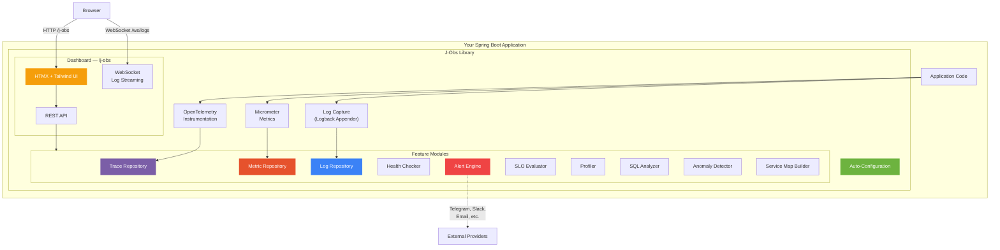
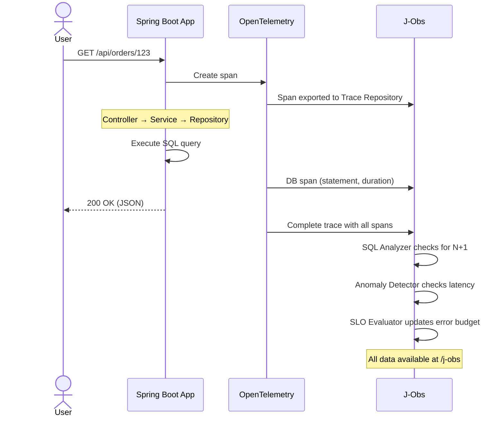
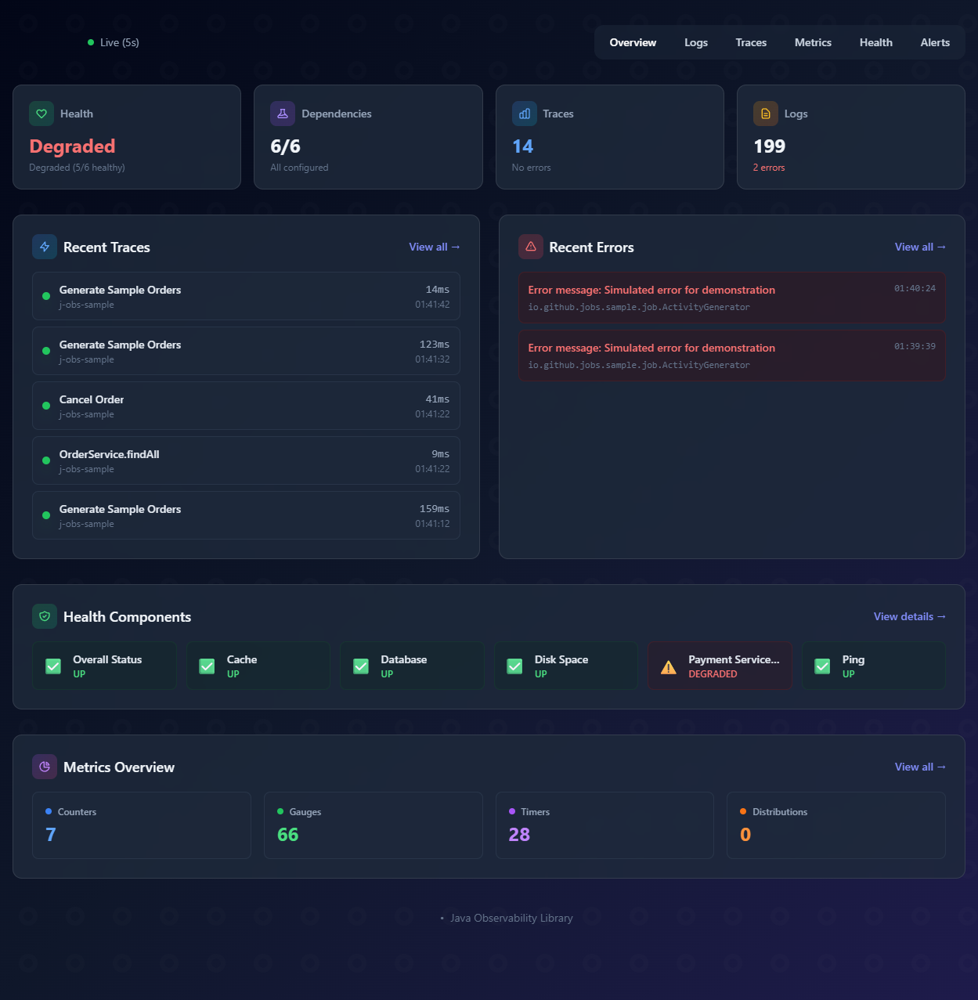
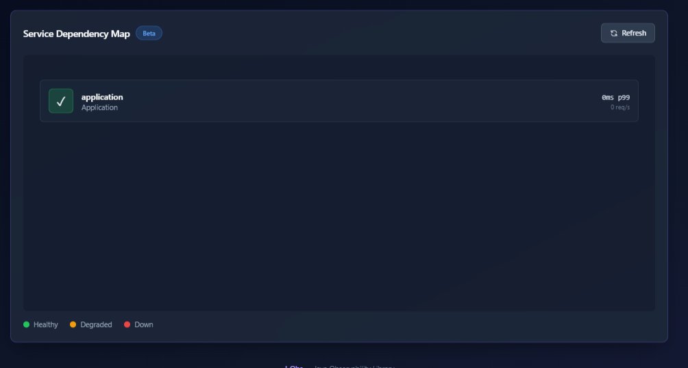
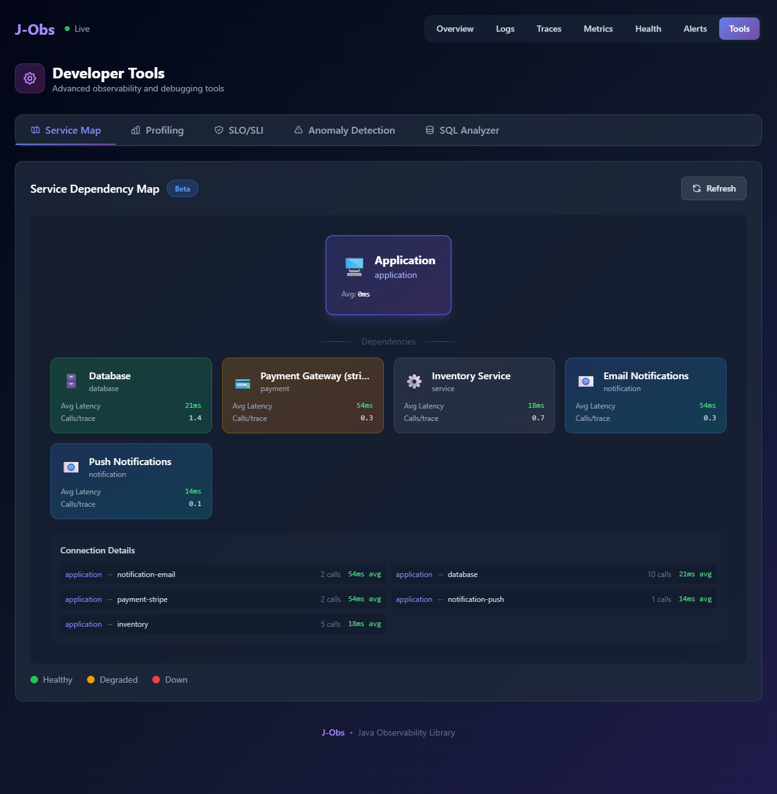
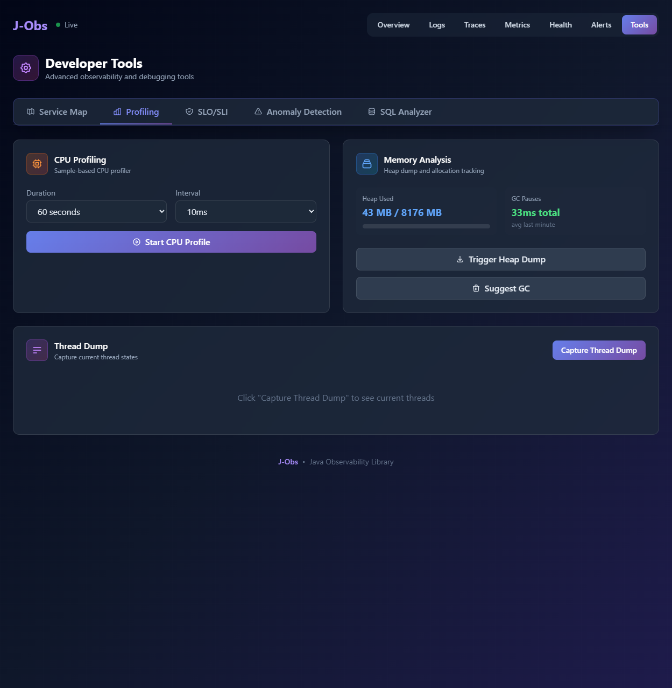

<div align="center">


# J-Obs

**Complete observability for Spring Boot — add one dependency, get everything.**

[](https://openjdk.org)
[](https://spring.io/projects/spring-boot)
[](https://opentelemetry.io)
[](https://prometheus.io)
[](https://central.sonatype.com/artifact/io.github.johnpitter/j-obs-spring-boot-starter)
[](LICENSE)

[Features](#-features) · [Architecture](#-architecture) · [Quick Start](#-quick-start) · [Configuration](#-configuration) · [Tech Stack](#-tech-stack)

</div>

---

## What is J-Obs?

J-Obs is a **Java observability library** that adds a complete monitoring dashboard to any Spring Boot application with a single dependency. Add it to your `pom.xml`, start your app, and access `/j-obs` — traces, logs, metrics, health checks, alerts, profiling, and more are all there.

Think of it as **Spring Boot Actuator on steroids** — with a built-in UI, real-time streaming, and zero external infrastructure required.

---

## Features

| Category | What you get |
|---|---|
| **Distributed Tracing** | Request journey with waterfall visualization, span details, and automatic instrumentation |
| **Real-Time Logs** | WebSocket streaming with level/logger/message filters, trace correlation |
| **Metrics Dashboard** | Latency percentiles (p50/p95/p99), throughput, error rate, JVM stats |
| **Health Monitoring** | Component status with history timeline, dependency health |
| **Alert System** | Multi-provider notifications — Telegram, Slack, Teams, Email, Discord, PagerDuty, Webhook |
| **SLO/SLI Tracking** | Error budgets, burn rates, multi-window alerting (Google SRE approach) |
| **CPU/Memory Profiling** | On-demand CPU sampling, heap snapshots, thread dumps — all from the browser |
| **Service Map** | Auto-generated dependency graph from traces with latency and error rate per connection |
| **SQL Analyzer** | N+1 detection, slow query analysis, missing index suggestions, SELECT * warnings |
| **Anomaly Detection** | Automatic latency spikes, error rate surges, and traffic anomaly detection |
| **Dependency Checker** | Auto-validates classpath requirements on first access with installation instructions |
| **Security** | Basic Auth, API Keys, CSRF protection, rate limiting, PBKDF2 password hashing |

---

## Architecture


```mermaid
graph TB
    subgraph SpringApp["Your Spring Boot Application"]
        APP["Application Code"]

        subgraph JObs["J-Obs Library"]
            AUTO["Auto-Configuration"]
            OTEL["OpenTelemetry<br/>Instrumentation"]
            MICRO["Micrometer<br/>Metrics"]
            LOGCAP["Log Capture<br/>(Logback Appender)"]

            subgraph Dashboard["Dashboard — /j-obs"]
                UI["HTMX + Tailwind UI"]
                API["REST API"]
                WS["WebSocket<br/>Log Streaming"]
            end

            subgraph Features["Feature Modules"]
                TRACES["Trace Repository"]
                LOGS["Log Repository"]
                METRICS["Metric Repository"]
                HEALTH["Health Checker"]
                ALERTS["Alert Engine"]
                SLO["SLO Evaluator"]
                PROF["Profiler"]
                SQL["SQL Analyzer"]
                ANOM["Anomaly Detector"]
                SMAP["Service Map Builder"]
            end
        end
    end

    USER[Browser] -->|"HTTP /j-obs"| UI
    USER -->|"WebSocket /ws/logs"| WS
    UI --> API
    API --> Features
    APP --> OTEL
    APP --> MICRO
    APP --> LOGCAP
    OTEL --> TRACES
    MICRO --> METRICS
    LOGCAP --> LOGS
    ALERTS -.->|Telegram, Slack,<br/>Email, etc.| EXT[External Providers]

    style AUTO fill:#6DB33F,color:#fff,stroke:none
    style UI fill:#F59E0B,color:#fff,stroke:none
    style TRACES fill:#7B5EA7,color:#fff,stroke:none
    style METRICS fill:#E6522C,color:#fff,stroke:none
    style LOGS fill:#3B82F6,color:#fff,stroke:none
    style ALERTS fill:#EF4444,color:#fff,stroke:none
```

### How the pieces fit together

| Component | Role | Tech |
|---|---|---|
| **Auto-Configuration** | Detects classpath, wires beans conditionally | Spring Boot AutoConfiguration |
| **Trace Repository** | Captures and stores distributed traces in-memory with TTL | OpenTelemetry SDK |
| **Log Repository** | Ring buffer of structured log entries with pub/sub | Logback Appender |
| **Metric Repository** | Caches and exposes Micrometer metrics | Micrometer + Prometheus |
| **Health Checker** | Aggregates Actuator health indicators with history | Spring Boot Actuator |
| **Alert Engine** | Evaluates rules, groups alerts, dispatches to providers | Custom + Throttling |
| **SLO Evaluator** | Computes error budgets and burn rates from metrics | Custom |
| **SQL Analyzer** | Detects N+1, slow queries, missing indexes from trace spans | Custom |
| **Dashboard** | Serves HTMX pages + REST API + WebSocket streaming | Spring MVC + WebSocket |

---

## Request Flow


```mermaid
sequenceDiagram
    actor User
    participant App as Spring Boot App
    participant OTel as OpenTelemetry
    participant JObs as J-Obs

    User->>App: GET /api/orders/123
    App->>OTel: Create span
    OTel->>JObs: Span exported to Trace Repository

    Note over App: Controller → Service → Repository
    App->>App: Execute SQL query
    OTel->>JObs: DB span (statement, duration)

    App-->>User: 200 OK (JSON)
    OTel->>JObs: Complete trace with all spans

    JObs->>JObs: SQL Analyzer checks for N+1
    JObs->>JObs: Anomaly Detector checks latency
    JObs->>JObs: SLO Evaluator updates error budget

    Note over JObs: All data available at /j-obs
```

---

## Quick Start

### Option A: All-in-one (everything included)

```xml
<dependency>
    <groupId>io.github.johnpitter</groupId>
    <artifactId>j-obs-spring-boot-starter</artifactId>
    <version>1.2.0</version>
</dependency>
```

### Option B: Pick only what you need

J-Obs offers **modular starters** so you can include only the features you need, reducing your dependency footprint:

```xml
<!-- Distributed tracing only (OpenTelemetry) -->
<dependency>
    <groupId>io.github.johnpitter</groupId>
    <artifactId>j-obs-starter-tracing</artifactId>
    <version>1.2.0</version>
</dependency>

<!-- Metrics dashboard only (Micrometer + Actuator) -->
<dependency>
    <groupId>io.github.johnpitter</groupId>
    <artifactId>j-obs-starter-metrics</artifactId>
    <version>1.2.0</version>
</dependency>

<!-- Real-time log streaming only (Logback + WebSocket) -->
<dependency>
    <groupId>io.github.johnpitter</groupId>
    <artifactId>j-obs-starter-logging</artifactId>
    <version>1.2.0</version>
</dependency>

<!-- CPU/Memory profiling only (JVM MXBeans) -->
<dependency>
    <groupId>io.github.johnpitter</groupId>
    <artifactId>j-obs-starter-profiling</artifactId>
    <version>1.2.0</version>
</dependency>
```

You can combine multiple starters:

```xml
<!-- Tracing + Metrics (no logging or profiling) -->
<dependency>
    <groupId>io.github.johnpitter</groupId>
    <artifactId>j-obs-starter-tracing</artifactId>
    <version>1.2.0</version>
</dependency>
<dependency>
    <groupId>io.github.johnpitter</groupId>
    <artifactId>j-obs-starter-metrics</artifactId>
    <version>1.2.0</version>
</dependency>
```

### Starter Comparison

| Starter | Dependencies Added | Features Enabled |
|---|---|---|
| `j-obs-spring-boot-starter` | All (OpenTelemetry, Micrometer, Logback, WebSocket, Actuator) | Everything |
| `j-obs-starter-tracing` | OpenTelemetry API + SDK | Traces, waterfall timeline, span details, SQL analyzer, anomaly detection, service map |
| `j-obs-starter-metrics` | Micrometer + Actuator | Metrics dashboard, latency percentiles, JVM stats, health monitoring, SLO/SLI |
| `j-obs-starter-logging` | Logback + WebSocket | Real-time log streaming, level/logger filters, trace correlation |
| `j-obs-starter-profiling` | None (uses JVM MXBeans) | CPU sampling, heap snapshots, thread dumps |

> **Note:** All starters include the base dashboard UI. Features auto-activate based on classpath — only the sections for your chosen starters appear in the dashboard.

### Configure (`application.yml`)

```yaml
# src/main/resources/application.yml
spring:
  application:
    name: my-app

j-obs:
  enabled: true
```

### Access the dashboard

```
Application:  http://localhost:8080
Dashboard:    http://localhost:8080/j-obs
```

**That's it.** J-Obs auto-detects your classpath and configures everything.

---

## Screenshots

| Dashboard | Traces |
|---|---|
|  |  |

| Service Map | Profiling |
|---|---|
|  |  |

---

## Configuration

### Security

```yaml
j-obs:
  security:
    enabled: true
    type: both          # "basic", "api-key", or "both"
    users:
      - username: admin
        password: ${J_OBS_PASSWORD}  # supports PBKDF2 hashed passwords
    api-keys:
      - ${J_OBS_API_KEY}
    api-key-header: X-API-Key
```

### Alerts

```yaml
j-obs:
  alerts:
    enabled: true
    providers:
      telegram:
        enabled: true
        bot-token: ${TELEGRAM_BOT_TOKEN}
        chat-ids: ["-1001234567890"]
      slack:
        enabled: true
        webhook-url: ${SLACK_WEBHOOK_URL}
      email:
        enabled: true
        host: smtp.gmail.com
        port: 587
        username: ${SMTP_USER}
        password: ${SMTP_PASSWORD}
        from: alerts@myapp.com
        to: ["team@myapp.com"]
```

### SLOs

```yaml
j-obs:
  slos:
    - name: api-availability
      description: "API should be 99.9% available"
      sli:
        type: AVAILABILITY
        metric: http_server_requests_seconds_count
      objective: 99.9
      window: 30d
```

### Full Configuration Reference

```yaml
j-obs:
  enabled: true
  path: /j-obs

  traces:
    enabled: true
    max-traces: 10000
    retention: 1h
    sample-rate: 1.0

  logs:
    enabled: true
    max-entries: 10000
    min-level: INFO

  metrics:
    enabled: true
    refresh-interval: 5000
    cache-duration: 30s

  health:
    enabled: true
    max-history-entries: 100

  profiling:
    enabled: true
    default-duration: 60s
    max-duration: 300s

  sql-analyzer:
    enabled: true
    slow-query-threshold: 1s
    n-plus-one-threshold: 5

  anomaly-detection:
    enabled: true
    baseline-window: 7d

  service-map:
    enabled: true
    refresh-interval: 30s

  rate-limiting:
    enabled: true
    requests: 1000
    window: 1m
```

> See [docs/CONFIGURATION.md](docs/CONFIGURATION.md) for all options.

---

## Automatic Instrumentation

Add observability to any class with annotations:

```java
@Service
@Observable  // Traces + Metrics automatically
public class OrderService {

    public Order create(OrderRequest request) {
        // Spans and metrics created automatically
        return new Order(...);
    }
}
```

| Annotation | Traces | Metrics | Description |
|---|---|---|---|
| `@Observable` | Yes | Yes | Full observability (recommended) |
| `@Traced` | Yes | No | Tracing only |
| `@Measured` | No | Yes | Metrics only |

---

## Tech Stack

<div align="center">

| Layer | Technology |
|:---:|:---:|
| **Core** | Java 17+, Spring Boot 3.2+ |
| **Tracing** | OpenTelemetry SDK + API |
| **Metrics** | Micrometer + Prometheus Registry |
| **Health** | Spring Boot Actuator |
| **UI** | HTMX + Tailwind CSS |
| **Real-Time** | WebSocket (Spring WebSocket) |
| **Security** | PBKDF2-SHA256, AES-256-GCM, CSRF tokens |
| **Testing** | JUnit 5, AssertJ, Spring Boot Test (296 tests) |

</div>

---

## Project Structure

```
j-obs/
  pom.xml                              # Parent POM with dependency management
  j-obs-bom/                           # Bill of Materials for version management

  j-obs-core/                           # Domain models and interfaces (no framework deps)
    src/main/java/
      io/github/jobs/
        domain/                         # Entities (Trace, Span, LogEntry, Alert, SLO, ...)
        application/                    # Service interfaces (ports)
        infrastructure/                 # In-memory repositories

  j-obs-spring-boot-starter/            # All-in-one starter (auto-configuration + UI)
    src/main/java/
      io/github/jobs/spring/
        autoconfigure/                  # 25 Spring Boot auto-configuration classes
        web/                            # REST controllers + HTML page controllers
        websocket/                      # WebSocket log streaming handler
        security/                       # Auth, CSRF, rate limiting, encryption
        alert/                          # Alert engine, grouping, throttling, providers
        slo/                            # SLO evaluation service + scheduler
        sql/                            # SQL analyzer (N+1, slow queries)
        anomaly/                        # Anomaly detection algorithms
        profiling/                      # CPU/memory/thread profiling service
        metric/                         # Micrometer metric caching
        log/                            # Logback appender + log sanitization
    src/main/resources/
      static/j-obs/                     # Dashboard UI assets (HTML, CSS, JS)
      META-INF/spring/                  # Auto-configuration registration

  j-obs-starter-tracing/                # Modular: OpenTelemetry distributed tracing
  j-obs-starter-metrics/                # Modular: Micrometer metrics + Actuator
  j-obs-starter-logging/                # Modular: Logback + WebSocket log streaming
  j-obs-starter-profiling/              # Modular: CPU/Memory/Thread profiling

  j-obs-sample/                         # Sample application with all features
  j-obs-benchmarks/                     # JMH performance benchmarks
  samples/                              # Additional integration examples
```

---

## API Endpoints

All endpoints are served under `{j-obs.path}` (default: `/j-obs`).

| Endpoint | Method | Description |
|---|---|---|
| `/j-obs` | GET | Dashboard (HTML) |
| `/j-obs/api/requirements` | GET | Dependency check status |
| `/j-obs/api/status` | GET | Overall system status |
| `/j-obs/api/capabilities` | GET | Available features |
| `/j-obs/api/logs` | GET | Query logs with filters |
| `/j-obs/api/traces` | GET | Query traces |
| `/j-obs/api/traces/{id}` | GET | Trace detail with spans |
| `/j-obs/api/metrics` | GET | Query metrics |
| `/j-obs/api/health` | GET | Health status + components |
| `/j-obs/api/alerts` | GET/POST/DELETE | Alert rules CRUD |
| `/j-obs/api/alert-events` | GET | Alert event history |
| `/j-obs/api/slos` | GET/POST/DELETE | SLO management |
| `/j-obs/api/profiling/cpu/start` | POST | Start CPU profiling |
| `/j-obs/api/profiling/memory` | POST | Capture heap snapshot |
| `/j-obs/api/profiling/threads` | POST | Capture thread dump |
| `/j-obs/api/sql/analyze` | GET | SQL analysis |
| `/j-obs/api/service-map` | GET | Service dependency map |
| `/j-obs/ws/logs` | WS | Real-time log streaming |

> See [docs/ACTUATOR.md](docs/ACTUATOR.md) for the full API reference.

---

## Compatibility

| Spring Boot | Java | Micrometer | Status |
|---|---|---|---|
| 3.4.x | 17, 21 | 1.14.x | Tested |
| 3.3.x | 17, 21 | 1.13.x | Tested |
| 3.2.x | 17, 21 | 1.12.x | Tested |
| 3.1.x | 17 | 1.11.x | Should work |
| 2.x | — | — | Not supported |

> **Tip:** Use `j-obs-bom` for version management — it covers all starters (including modular ones) and won't conflict with Spring Boot's dependency management.

---

## Sample Application

```bash
cd j-obs-sample
mvn spring-boot:run
# Dashboard: http://localhost:8080/j-obs
```

---

## Documentation

| Document | Description |
|---|---|
| [FEATURES.md](docs/FEATURES.md) | Detailed feature documentation |
| [CONFIGURATION.md](docs/CONFIGURATION.md) | All configuration options |
| [SECURITY.md](docs/SECURITY.md) | Authentication and security |
| [ACTUATOR.md](docs/ACTUATOR.md) | API endpoints reference |
| [OTLP_INTEGRATION.md](docs/OTLP_INTEGRATION.md) | OTLP agent and external collectors |
| [TROUBLESHOOTING.md](docs/TROUBLESHOOTING.md) | Common issues and solutions |
| [GETTING_STARTED.md](docs/GETTING_STARTED.md) | Step-by-step tutorial |
| [CHANGELOG.md](CHANGELOG.md) | Version history |

---

## Contributing

Contributions are welcome! Please:

1. Fork the repository
2. Create a feature branch
3. Submit a pull request

---

<div align="center">

**Built with Java and Spring Boot by [@JohnPitter](https://github.com/JohnPitter)**

</div>
